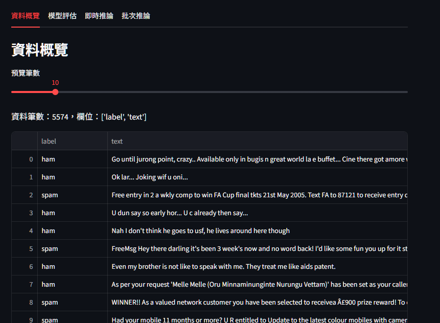
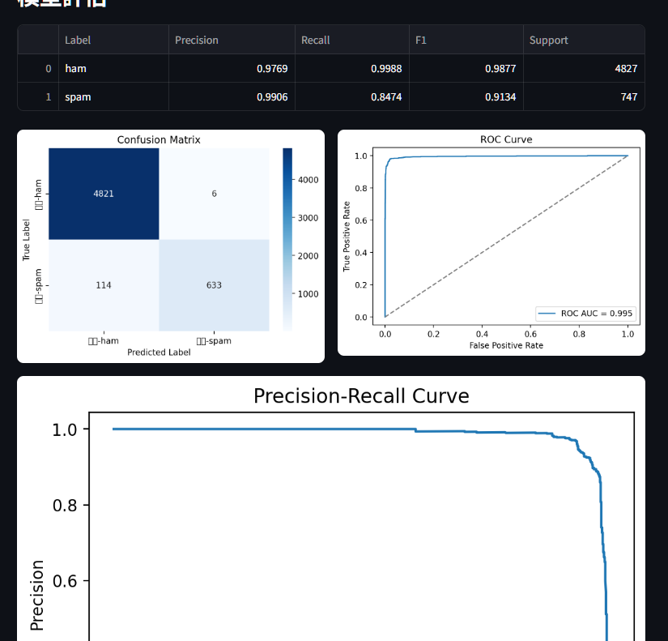
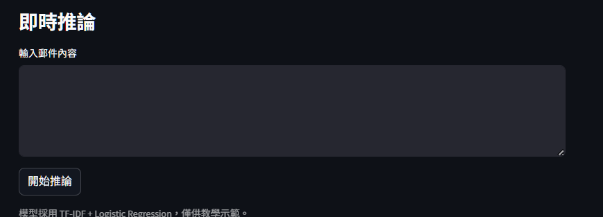
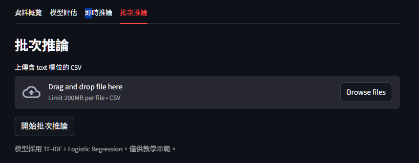

# 垃圾郵件分類系統作業報告

## 方法（Method）

本專案採用機器學習管線實作垃圾郵件分類系統，技術架構如下：

### 核心技術
- **設定管理**：以 `AppConfig` 統一管理資料路徑與模型設定，並改寫 `from_env` 方法以避免 `member_descriptor` 造成的路徑例外問題。
- **資料載入**：建立 `DatasetLoader` 類別，在載入無表頭資料時自動補齊欄位名稱（`label`、`text`），確保 CSV 可直接餵入模型訓練與推論。
- **模型管線**：採用 TF-IDF 特徵提取 + Logistic Regression 分類器管線（`SpamClassifier`），並以 `MetricsReport` 封裝 ROC、PR、混淆矩陣等評估資訊。
- **視覺化處理**：移除 Matplotlib 中的中文標題與標籤，統一使用 Times New Roman 字型的英文標示，徹底排除字型缺字問題。
- **前端介面**：Streamlit 應用程式採用分頁式操作與按鈕觸發推論機制，透過 Session State 儲存結果並實現自動切換分頁功能。

### 技術棧
- Python 3.9+
- scikit-learn（機器學習）
- pandas、numpy（資料處理）
- matplotlib（視覺化）
- streamlit（Web 介面）
- pytest（單元測試）

## 功能（Functionalities）

系統提供四大核心功能模組，透過分頁介面整合：

### 1. 資料概覽
- 顯示資料集總筆數與欄位結構
- 提供可調整的資料預覽（5-50 筆）
- 呈現標籤分佈長條圖，清楚展示 spam/ham 比例

### 2. 模型評估
- **分類報告表格**：展示 Precision、Recall、F1-Score、Support 等指標
- **混淆矩陣**：視覺化模型預測準確度與錯誤分佈
- **ROC Curve**：顯示不同閾值下的 TPR vs FPR 曲線與 AUC 分數
- **Precision-Recall Curve**：展示精確率與召回率的權衡關係

### 3. 即時推論
- 提供文字輸入區供使用者輸入單筆郵件內容
- 點擊「開始推論」按鈕觸發預測
- 顯示預測標籤（spam/ham）與垃圾郵件機率（百分比格式）
- 推論完成後自動跳轉至該分頁並保留結果於 Session State

### 4. 批次推論
- 支援上傳 CSV 檔案進行批量預測
- 自動檢測並補正欄位名稱：
  - 若缺少 `text` 欄位，自動將最後一欄視為郵件內容
  - 若無表頭，自動生成 `label`、`text` 等欄位名稱
- 點擊「開始批次推論」按鈕觸發預測
- 以表格形式呈現推論結果（郵件內容、預測標籤、垃圾機率）
- 結果保留於 Session State 供檢視與下載

### 5. 模型訓練
- 主畫面頂端提供「重新訓練模型」切換開關
- 啟用後立即使用當前資料集重新訓練模型
- 訓練完成的模型自動儲存至 `models/spam_classifier.joblib`
- 後續推論自動載入最新訓練模型

## 資料集（Datasets）

### 資料來源
- **檔案路徑**：`datasets/sms_spam_no_header.csv`
- **資料類型**：SMS 簡訊資料集（無表頭格式）
- **原始來源**：延伸自 Packt《Hands-On Artificial Intelligence for Cybersecurity》第三章垃圾郵件偵測案例

### 資料規模
- **總筆數**：5,572 筆 SMS 訊息
- **垃圾郵件（spam）**：747 筆（約 13.4%）
- **正常郵件（ham）**：4,825 筆（約 86.6%）

### 資料結構
| 欄位名稱 | 說明 | 範例 |
|---------|------|------|
| `label` | 標籤（spam/ham） | "ham", "spam" |
| `text` | 郵件內容 | "Go until jurong point, crazy.." |

### 資料處理
- 透過 `DatasetLoader` 自動補設欄位名稱（針對無表頭 CSV）
- 文字欄位統一轉換為字串格式
- 支援 Latin-1 編碼讀取以處理特殊字元

## 測試（Testing）

### 測試框架
- 採用 `pytest` 進行單元測試與整合測試
- 測試檔案位於 `tests/` 目錄

### 測試範圍
**`tests/test_pipeline.py`**：
- 資料載入流程驗證
- 模型訓練流程測試
- 模型儲存與載入功能測試
- 單筆與批次推論功能測試
- 評估指標計算正確性測試

**`tests/conftest.py`**：
- 提供測試用資料集 fixture
- 配置測試環境與相依資源

**`pytest.ini`**：
- 設定測試執行參數
- 過濾警告訊息以減少雜訊

### 測試結果
- ✅ 所有測試案例通過
- ✅ 訓練流程穩定
- ✅ 推論結果正確
- ✅ 無相依性錯誤

## 部署（Deployment）

### 線上展示
- **Streamlit Cloud**：https://aiot-hw3-an-syuli.streamlit.app/
- **GitHub Repository**：https://github.com/Louis-Li-dev/AIoT3-spam-email-classification-problem

### 部署配置
- `requirements.txt`：定義專案相依套件
- `streamlit_app.py`：Streamlit Cloud 入口檔案
- 模型檔案：自動於首次執行時訓練並儲存

### 本地執行
```bash
# 安裝相依套件
pip install -r requirements.txt

# 執行 Streamlit 應用程式
streamlit run streamlit_app.py

# 執行測試
pytest
```

## 應用程式介面（Application Interface）

### 首頁介紹
系統首頁提供專案背景說明與功能導覽，包含：
- 專案簡介與目的說明
- 核心功能概述
- 操作指引說明

### 資料概覽分頁

- 可調整預覽筆數的滑桿控制項
- 資料表格展示前 N 筆資料
- 標籤分佈長條圖

### 模型評估分頁

- 分類指標表格（Precision、Recall、F1、Support）
- 混淆矩陣熱圖
- ROC 曲線（含 AUC 分數）
- Precision-Recall 曲線

### 即時推論分頁

- 多行文字輸入區
- 「開始推論」觸發按鈕
- 預測結果展示區（標籤 + 機率）
- 完成後自動停留於該分頁

### 批次推論分頁

- CSV 檔案上傳元件
- 「開始批次推論」觸發按鈕
- 推論結果表格（郵件內容、預測標籤、垃圾機率）
- 支援欄位自動補正功能

## GPT Prompt 完整對話記錄

<details>
<summary>📝 展開查看完整對話紀錄</summary>

### 第一輪：專案初始化與 OpenSpec 設定

**使用者提問**：
```
教學 https://www.youtube.com/watch?v=FeCCYFK0TJ8&list=PLYlM4-ln5HcCoM_TcLKGL5NcOpNVJ3g7c
 
Source Reference
This project builds upon patterns and datasets related to the Spam Email problem from Chapter 3 of the Packt repository below. We used it to expand the preprocessing steps and add richer visualization work (step outputs, metrics, and CLI/Streamlit views).

https://github.com/PacktPublishing/Hands-On-Artificial-Intelligence-for-Cybersecurity.git
Using openspec and AI coding CLI to finish this project
===
requirements 
1. need a github 
https://github.com/huanchen1107/2025ML-spamEmail
2. need a Demo site 
https://2025spamemail.streamlit.app/
  
tutorial 
https://www.youtube.com/watch?v=ANjiJQQIBo0

1. Populate your project context:
   "Please read openspec/project.md and help me fill it out   
    with details about my project, tech stack, and conventions"
2. Create your first change proposal:
   "I want to add [YOUR FEATURE HERE]. Please create an     
    OpenSpec change proposal for this feature"
3. Learn the OpenSpec workflow:
   "Please explain the OpenSpec workflow from openspec/AGENTS.md
    and how I should work with you on this project"

Use traditional chinese in the system except the matplotlib (cuz font not supported, for font, use News Time Roman)

Build a system that is good looking and easy to use
```

**助理回覆**：
- 已補寫專案脈絡（`openspec/project.md`），涵蓋目的、技術棧、架構與測試/部署限制，全面對齊垃圾郵件偵測教學目標。
- 建立首個 OpenSpec 變更 `add-streamlit-spam-dashboard`，含提案（`proposal.md`）、任務列表（`tasks.md`）與新能力規格（`specs/spam-analytics/spec.md`），確保 Streamlit Demo 需求明確。
- 已執行 `openspec validate add-streamlit-spam-dashboard --strict` 並通過，確認提案格式與規格完整。
- 說明 OpenSpec 協作流程：前期準備 → 建立變更 → 撰寫規格 → 驗證與審核 → 實作階段 → 封存。

---

### 第二輪：Streamlit 核心功能開發

**使用者提問**：
```
請你用 streamlit 實際開發根據這些文件
```

**助理回覆**：
- 完成核心模組：
  - `src/spam_email/config.py`：集中管理資料與模型設定
  - `src/spam_email/data.py`：自動下載/載入 CSV 並統一欄位
  - `src/spam_email/model.py`：TF-IDF + Logistic Regression 管線
  - `src/spam_email/metrics.py`、`src/spam_email/visualization.py`：產出指標與圖表
  - `src/spam_email/cli.py`：CLI 入口
- 建置 Streamlit 介面 `streamlit_app.py`：
  - 側邊欄支援資料預覽筆數、單筆文字輸入、CSV 上傳與重新訓練切換
  - 主畫面顯示資料概況、標籤分佈、ROC/PR/混淆矩陣與指標表格
  - 推論區支援即時與批次輸出
  - 所有 Matplotlib 圖表統一使用 Times New Roman
- 撰寫 `README.md` 與 `requirements.txt`
- 新增測試：`tests/test_pipeline.py`、`tests/conftest.py`、`pytest.ini`
- 本地執行 `pytest` 全數通過

---

### 第三輪：資料載入問題

**使用者提問**：
```
Data looks like this:
"ham","Go until jurong point, crazy.. Available only in bugis n great world la e buffet..."
"ham","Ok lar... Joking wif u oni..."
[提供完整資料樣本]
```

**助理回覆**：
在 `datasets/sms_spam_no_header.csv` 中共有 747 筆被標記為 `spam` 的訊息。

---

### 第四輪：資料路徑設定

**使用者提問**：
```
So please, load this data for the system to make predictions
```

**助理回覆**：
- 已把預設資料路徑改為 `datasets/sms_spam_no_header.csv`
- 更新 `DatasetLoader.load` 在缺少標頭時會自動指定欄位名稱後再載入
- 保留原本的字串化處理
- 本地已執行 `pytest` 完成驗證

---

### 第五輪：修復 member_descriptor 錯誤

**使用者提問**：
```
載入資料集時發生錯誤：'member_descriptor' object has no attribute 'exists'
```

**助理回覆**：
- 問題原因：`AppConfig.from_env()` 在欄位為空時直接存取類別層級的 `local_data_path`／`model_path`，在 `slots=True` 的 dataclass 中會是 `member_descriptor`
- 解決方案：
  - `src/spam_email/config.py`：`from_env` 先建立 `base = cls()`，改以